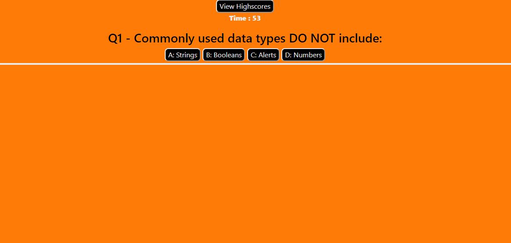
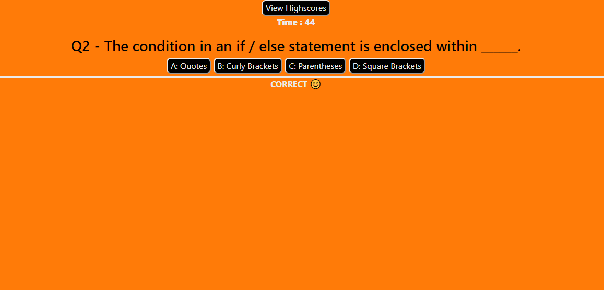
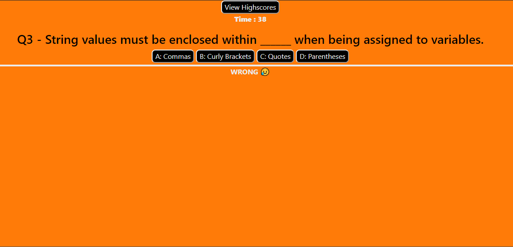
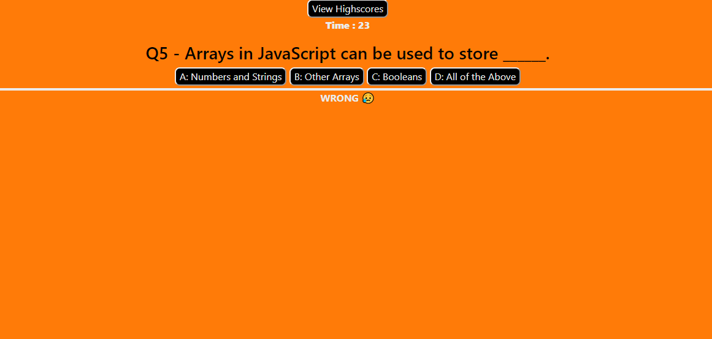

# 04 Web APIs - Code Quiz

Full Flex Web Development Bootcamp - by Jacob Hegan

[GitHub Repository](https://github.com/heganjr/04-code-quiz-JH)

[GitHub Pages URL](https://heganjr.github.io/04-code-quiz-JH/)

---

## The Task

In order to test a student's knowledge on JavaScript basic fundamentals a quiz was created testing this knowledge on the basics of JavaScript.

When the user click's the START! button they are given 60 seconds to answers five multiple choice questions with four possible answers on the above topic.

The user is notified of every right and wrong answwer with "CORRECT 😊" and "WRONG 😥". For every incorrect answer the application deducts 10 seconds from the time remaining.

After the user has answered all five questions or the 60 seconds has lapsed, the game is over and the final score is displayed as the time remaining.

The user is given the opportunity to enter their initials in the input field to submit their score on the leaderboard.

This input field saves the user's score and initials into local storage and appends the object strings to the leaderboard as a list item which is sorted in descending order.

The user has the option to click the "Go Back" to refresh the page and attempt the quiz again.

---

## Screenshots

